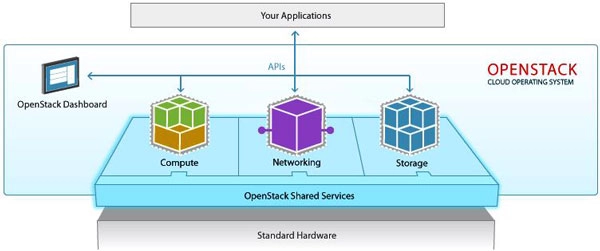

# Openstack

Openstack là nền tảng điện toán đám mây nguồn mở, có khả năng hỗ trợ cả public cloud (đám mây công cộng) và private cloud (đám mây riêng tư). Nền tảng này cung cấp cho người dùng giải pháp xây dựng hạ tầng điện toán đám mây có khả năng mở rộng cao, với nhiều tính năng nổi bật.

## Các thành phần bên trong Openstack

- **Compute Infrastructure**: bao gồm các loại nova như nova compute, nova network, nova schedule, nova api và nova volume. Khi đó No- Schedule có nhiệm vụ lọc ra các thông tin cụ thể từ số lượng thông tin khổng lồ để cung cấp một cách kịp thời, no-compute sẽ chạy các máy ảo, No-network thực hiện việc cấu hình lại các mạng ảo cho máy ảo. Cuối cùng là No-Volume với nhiệm vụ tiếp nhận công việc xử lý, tạo xóa thêm hoặc bớt các volume vào instance.

- **Storage Infrastructure (Swift)**: bao gồm Proxy node và Storage nodes. Đầu tiên các proxy nodes sẽ tiếp nhận yêu cầu xử lý và gửi về cho storage nodes, sau đó thực hiện sao lưu các mục yêu cầu dưới một account, khu lưu trữ (container) hoặc vùng đối tượng (các object). Mặt khác, thông tin thêm các container sẽ thuộc sở hữu của một account (không giới hạn số lượng) và các object sẽ là các tập con bên trong container. Chính vì vậy, điều bắt buộc là phải có ít nhất một container bên trong account để tiến hành các thao tác update. Tóm lại, Swift sẽ thực hiện các công việc như ghi chép lại các thông tin dữ liệu.

- **Imaging service (Glance)**: có chức năng xử lý những file ảnh của máy chủ ảo. Đồng thời, thực hiện được một số công việc quản trị khác như cập nhật thêm các tính năng virtual disk images, cài đặt các chế độ quyền riêng tư cho các hình ảnh, dễ dàng tùy biến việc chỉnh sửa hoặc xoá ảnh.

## Nguyên lý hoạt động của Openstack

- **Glance**: tạo Immage của OS((ubuntu, window,...), tác dụng của việc xóa, sửa các metadat của Image.
- **Neutron**: tạo network group(nghĩa là tạo một các tên cho các network trong project), sau đó trong network group ta tạo nhiều subnet kèm theo nhiều policy đi kèm, để các VM kết nối vào subnet.
- **Cinder**: tạo các volume block storage nmhawmf cung cấp cho việc tạp VM. Bởi cấu hình tạo VM bắt buộc phải sử dụng block storage, vì ít nhất VM phải cần có chỗ lưu OS với nguyên tắc OS phải lưu trên block storage để MV có thể boot.
- **Keystone**: là service chứng thực chínhl người dùng yêu cầu đến tất cả các service đều phải cần chứng thực để sử dụng. Người dùng yêu cầu lấy tất cả thông báo từ keystone sau đó keystone trả về người dùng một thông báo và gửi đến service 1 bản sao thông báo trên, người dùng lại yêu cầu đến server thông qua thông báo nhận được cho đến khi service chấp nhận yêu cầu khi khớp với thông báo.
- **Swift**: cung cấp object storage dịch vụ lưu trữ có thể hoạt động riêng biệt như google drive, drobbox,...) họặc cũng có thể tích hợp vào VM để cung cấp nơi lưu trữ.
- **Nova**: nhận yêu cầu liên quan đến việc quản lý VM từ người dùng( tạo, xóa, sửa...) thu gom các tài nguyên liên quan như RAM, CPU từ bản thân service nó quản lý và các tài nguyên các từ service khác trả bao gồm Network, Volume, Image,... để tạo nên máy ảo cũng như giám sát các tài nguyên đó.