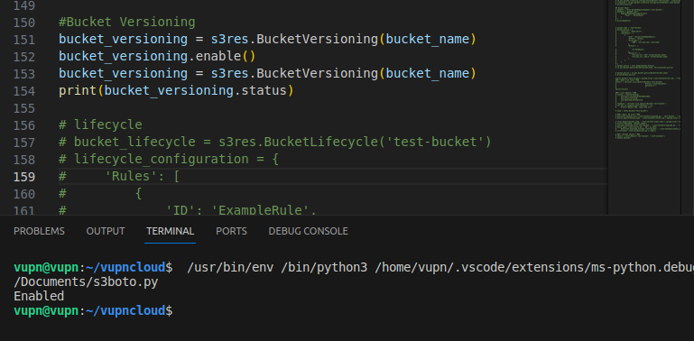

**Quản lý Bucket Versioning**         

Bucket Versioning là tính năng cho phép bạn lưu trữ nhiều phiên bản của cùng một đối tượng trong Cloud Storage. Khi bạn bật Bucket Versioning, sẽ tự động tạo một phiên bản lưu trữ mỗi khi file bị ghi đè hoặc xoá, cho phép người dùng có thể khôi phục file về các trạng thái trước đó.

**On/Off bucket versioning**
```
bucket_versioning = s3.BucketVersioning(bucketname)
bucket_versioning.enable()
bucket_versioning.suspend()
```

Xem trạng thái hiện tại:
```
bucket_versioning = s3.BucketVersioning(bucketname)
print(bucket_versioning.status)
```

