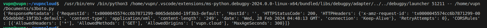

## Quản lý Bucket CORS                      

Cross-Origin Resource Sharing (CORS) là một cơ chế cho phép các ứng dụng web truy cập tài nguyên từ các miền khác. CORS được sử dụng để bảo mật tài nguyên và ngăn chặn các truy cập trái phép.

**Set bucket CORS**

```
bucket = s3.Bucket('<BUCKET-NAME>')
bucket_cors = bucket.Cors()
config = {
    'CORSRules': [
        {
            'AllowedMethods': ['GET'],
            'AllowedOrigins': [vupn.cloud'],
            'AllowedHeaders': ['*'],
            'MaxAgeSeconds': 300
        }
    ]
}
bucket_cors.put(CORSConfiguration=config)
```
**Get bucket CORS**
```
bucket_cors = s3client.get_bucket_cors(Bucket='<BUCKET-NAME>')
print(bucket_cors)
```

