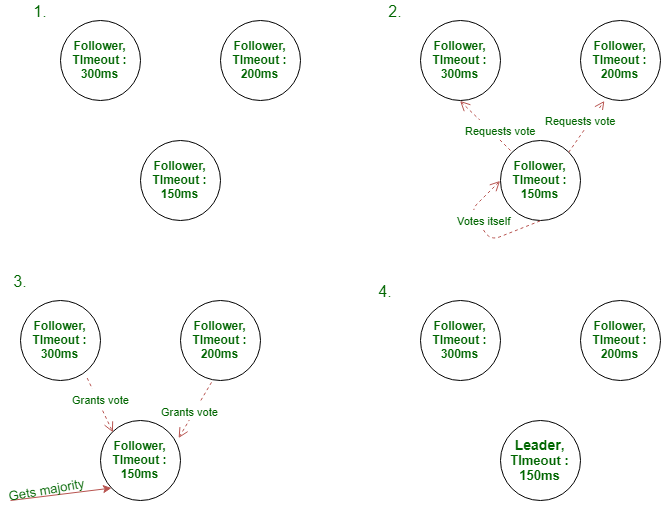

Random write và sequential write đều là các phương pháp ghi dữ liệu trên đĩa cứng (hard disk) của máy tính. Tuy nhiên, chúng khác nhau về cách thức và hiệu quả trong việc lưu trữ và truy xuất dữ liệu.

Random write là phương pháp ghi dữ liệu vào các vị trí ngẫu nhiên trên đĩa cứng, mà không cần quan tâm đến vị trí các khối dữ liệu trước đó. Việc ghi dữ liệu theo phương pháp này có thể dẫn đến việc tạo ra các khoảng trống trên đĩa cứng, khiến cho việc truy xuất dữ liệu trở nên chậm hơn do phải di chuyển đầu đọc/ghi đến các vị trí khác nhau trên đĩa cứng.

Ngược lại, sequential write là phương pháp ghi dữ liệu vào các vị trí liên tiếp trên đĩa cứng, theo một thứ tự được xác định trước. Phương pháp này cho phép tối ưu hóa việc truy xuất dữ liệu, vì việc đọc/giữa dữ liệu có thể được thực hiện một cách liên tục mà không phải di chuyển đầu đọc/ghi đến các vị trí khác nhau trên đĩa cứng. Sequential write thường được sử dụng để lưu trữ các file lớn như video, âm nhạc hoặc các file backup.

Tùy thuộc vào usecase cụ thể, một trong hai phương pháp ghi dữ liệu có thể có lợi thế về tốc độ và throughput hơn. Ví dụ, khi cần ghi một lượng lớn dữ liệu, sequential write sẽ cho phép tối ưu hóa việc ghi dữ liệu và tăng tốc độ ghi. Ngược lại, nếu cần thực hiện các thao tác ghi dữ liệu ngẫu nhiên trên đĩa cứng, random write có thể là phương pháp hiệu quả hơn.

```
with open('random_write.txt', 'r+') as f:
    f.seek(6)  
    f.write('XYZ')
print('random')


with open('requential_write.txt', 'w') as f:
    for i in range(10):
        f.write(f'This is line {i+1}\n')    
print('requential')
```


