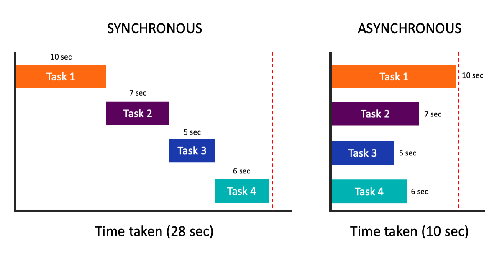

# Synchronous và Asynchronous

Synchronous operation (hoạt động đồng bộ) là khi các tác vụ được thực hiện một cách tuần tự, theo thứ tự mà chúng được gọi. Điều này có nghĩa là một tác vụ phải hoàn thành trước khi tác vụ tiếp theo được thực hiện. Điều này có thể dẫn đến trường hợp chương trình bị chặn lại, đợi đến khi một tác vụ hoàn thành mới có thể thực hiện tác vụ tiếp theo.

Ngược lại, asynchronous operation (hoạt động bất đồng bộ) là khi các tác vụ được thực hiện độc lập với nhau, mà không cần chờ đợi tác vụ trước đó hoàn thành. Thay vào đó, các tác vụ được gửi đi và tiếp tục thực hiện ngay lập tức, trong khi chương trình tiếp tục thực hiện các tác vụ khác. Khi một tác vụ hoàn thành, kết quả được trả về cho chương trình.

Asynchronous operation có thể giúp tăng tốc độ và hiệu suất của chương trình, tránh chặn lại và giảm độ trễ trong khi đang chờ đợi một tác vụ hoàn thành. Tuy nhiên, việc quản lý các tác vụ bất đồng bộ có thể phức tạp hơn so với việc quản lý các tác vụ đồng bộ.
